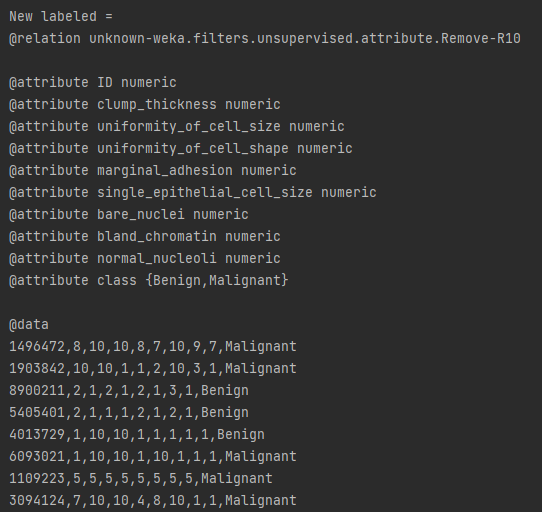

---
header-includes:
   - \usepackage{hyperref}
   - \usepackage{float}
output:
    pdf_document:
      number_sections: yes
      toc: no
      keep_tex: yes
title: "Breast Cancer Wisconsin\\vspace{0.5cm}"
subtitle: "Analysis of breast cancer and stage prediction using machine learning\\vspace{1in}"
author: "\\includegraphics{images/breast-cancer-analysis.jpeg}"
date: "Image of fine needle aspiration of breast cancer cells\\cite{neuraldesigner}"

linkcolor: blue
---
\vfill
\mbox{}
\begin{flushright}
Rose Hazenberg\linebreak
407050\linebreak
BFV3\linebreak
`r Sys.Date()` \linebreak
Michiel Noback\linebreak 
\end{flushright}
\pagenumbering{gobble}

\newpage
\mbox{}
\pagenumbering{gobble}

\newpage
\begin{center}
{\LARGE Breast Cancer Wisconsin\linebreak}
Analysis of breast cancer and stage prediction using machine learning
\end{center}

\vfill
\mbox{}
\begin{flushright}
Rose Hazenberg\linebreak
407050\linebreak
Bio-informatica\linebreak
Life Science and Technology\linebreak
Michiel Noback\linebreak 
`r Sys.Date()` \linebreak
\end{flushright}

\newpage
# Abbreviations and symbols

Abbreviations                               |Symbols
--------------------------------------------|----
Fine Needle Aspiration                      |FNA
Artificial Intelligence                     |AI
Exploratory Data Analysis                   |EDA
Principal Component Analysis                |PCA
True Positive                               |TP 
False Positive                              |FP 
True Negative                               |TN 
False Negative                              |FN
True Positive Rate                          |TPR
False Positive Rate                         |FPR
Receiver Operating Characteristics          |ROC
Area Under The Curve                        |AUC

\newpage
\mbox{}
\tableofcontents

\newpage
\pagenumbering{arabic}
\setcounter{page}{6}

```{r setup, include=FALSE}
knitr::opts_chunk$set(echo = FALSE)
# Add: chunk caching
knitr::opts_chunk$set(cache = TRUE)
```

```{r, eval=FALSE}
##################################################
## Libraries
##################################################
library(utils)
library(kableExtra)
library(dplyr)
library(tidyr)
library(ggplot2)
library(stats)
library(pheatmap)
library(cowplot)
library(ggbiplot)
library(ggpubr)
```

\newpage
# Introduction 

Despite a great deal of public awareness and scientific research, breast cancer continues to be the most common cancer and the second largest cause of cancer deaths among women. Approximately 12% of U.S. women will be diagnosed with breast cancer, and 3.5% will die of it. The annual mortality rate of approximately 28 deaths per 100,000 women has remained nearly constant over the past 20 years. A breast cancer victim's chances for long-term survival are improved by early detection of the disease, and early detection is in turn enhanced by accurate diagnosis.\cite{research}

There are two significant applications of linear programming in the field of breast cancer research, one in diagnosis and one in prognosis. Both applications, in clinical practice, depend on the analysis of cellular images which is accomplished with a graphical computer program called **Xcyt**, written by one of the authors.\cite{research}

First, a sample of fluid is taken from the patient's breast. The procedure involves using a small-gauge needle to take fluid, known as Fine Needle Aspiration (FNA), directly from a breast lump or mass. This allows an accurate diagnosis without the need for a surgical biopsy. From the FNA an image is generated which is then used for the program Xcyt.\cite{research} Xcyt uses a curve-fitting program to determine the exact boundaries of the cancer cell based on a digital scan. Thus a digitized image is used to assess whether a lump in a breast could be malignant (cancerous) or benign (non-cancerous).\cite{neuraldesigner} 

Machine learning plays an important role in the classification of breast cancer. Many diagnosis processes have been discussed besides the images. These types of diagnosis images are used for classification using machine learning.\cite{review paper} Machine learning is a form of Artificial Intelligence (AI) aimed building systems that can learn from the processed data or use data to perform better.\cite{oracle} 

## Goal

The goal of this research is to answer the question, is it possible to reliably predict the breast cancer stage based on the uniformity of cell size and the shape using machine learning? The goal will be reached by analysing the breast cancer dataset through figures created with RStudio. In addition, a model a created that predicts the breast cancer stage using the machine learning software tool Weka. The model will be used to predict the class of new, unknown instances through a program created with Java.

\newpage 
# Materials & Methods

## Materials 

The dataset that is used in this paper contains information about breast cancer in Wisconsin and is online available.\cite{dataset} The data was created by Dr. William H. Wolberg a physician at the University of Wisconsin Hospitals, Madison, Wisconsin, USA.

The samples are clinical cases of Dr. Wolberg which are periodically classified and are ordered in a chronological grouping. Which is as followed:

Group 1: 367 instances (January 1989)  
Group 2: 70 instances (October 1989)  
Group 3: 31 instances (February 1990)  
Group 4: 17 instances (April 1990)  
Group 5: 48 instances (August 1990)  
Group 6: 49 instances (Updated January 1991)  
Group 7: 31 instances (June 1991)  
Group 8: 86 instances (November 1991)  
-----------------------------------------  
Total: 699 points (as of the donated database on 15 July 1992 to Olvi Mangasarian)\cite{dataset} 

The dataset created by Dr. Wolberg is based on fluid samples, taken from patients with solid breast masses, and the graphical computer program Xcyt. The program used a curve-fitting algorithm to compute ten features from each one of the cells in the sample.\cite{paper} 

The codebook of the breast cancer data as shown in table \ref{tab:codebook} provides an overview of the data frame and the variables. Each feature was evaluated on a scale of 1-10, with 1 being the closest to benign and 10 being the closest to malignant. In total has the dataset 16 missing values which are in 'Bare Nuclei' for different instances. The classification is based on two values; benign and malignant. 

```{r codebook}
##################################################
## Codebook
##################################################
## Load the codebook
codebook <- read.csv(file = "codebook.txt", sep = ";")
kable(codebook, caption = "Codebook with an overview of the data.") %>%
  kable_styling(latex_options = "HOLD_position")
```

For the analysis of the breast cancer dataset, the software tool RStudio Version 1.4.1717 \cite{RStudio} is used. RStudio is an environment for using statistical computing and graphic, that uses the R programming language Version 4.0.4. In RStudio there are a few libraries that R used throughout this project these are listed in table \ref{tab:libraries} and the appendix.

\begin{longtable}[l]{l|l|l}
\caption{Libraries} \\ \hline
\label{tab:libraries} \\ \hline
$\textbf{Library}$ &$\textbf{Version}$ &$\textbf{Goal}$\\ \hline
\endhead
$\text{utils}$ & $\text{4.0.4}$  &$\text{Reads and writes files in R}$\\ \hline
$\text{kableExtra}$ & $\text{1.3.4}$  &$\text{Build common complex tables}$\\ \hline
$\text{dplyr}$ & $\text{1.0.7}$  &$\text{Provides data manipulation}$\\ \hline
$\text{tidyr}$ & $\text{1.1.3}$  &$\text{Tool for changing shape of a dataset}$\\ \hline
$\text{ggplot2}$ & $\text{3.3.5}$  &$\text{System for creating graphics}$\\ \hline
$\text{stats}$ & $\text{4.0.4}$  &$\text{Functions for statistical calculations}$\\ \hline
$\text{pheatmap}$ & $\text{1.0.12}$ &$\text{Creates heatmaps}$\\ \hline
$\text{cowplot}$ & $\text{1.1.1}$ &$\text{Arrange multiple plots into a grid}$\\ \hline
$\text{ggbiplot}$ & $\text{0.55}$  &$\text{Biplot for Principal Components}$\\ \hline
$\text{ggpubr}$ & $\text{0.4.0}$  &$\text{Some easy-to-use functions for creating and customizing ‘ggplot2’}$\\ \hline
\end{longtable}

Machine learning is used to analyse and build classifiers to generate a model that predicts the breast cancer stage. The software tool that is used is to make this happen is Weka Version 3.8.5.\cite{Weka} Weka is an open-source software that provides tools for data processing, implementation of several machine learning algorithms.

After the best model was created and saved. The model is used in Java to create a Java wrapper. To create the Java wrapper the software program IntelliJ IDEA Version 2021.2.1 was used.\cite(intellij) IntelliJ uses Java Version 8 update 311.\cite{Java} Besides Java, IntelliJ needs Java SE Development Kit 17.0.1. This is called JDK and is a development environment for building applications using the Java programming language. It includes tools useful for developing and testing programs written in the Java programming language and running on the JavaTM platform.\cite{JDK}

## Methods 

In RStudio is first the Exploratory Data Analysis (EDA) was performed using R. This was done by visualizing, transforming, and modeling the data. By making multiple plots in R with the given libraries in table\ref{tab:libraries}, is the data visualized where the variation, distribution, missing value, and clustering of the breast cancer dataset is shown. There were multiple plots created with the libraries ggplot2, pheatmap, and ggbiplot but there were also tables generated with kableExtra. After visualizing which data is relevant and which isn't had the data been cleaned. The cleaned breast cancer data was used for machine learning in Weka. In Weka there were multiple algorithms applied and compared with 10-fold cross-validation to get the best model to classify instances. This was done with the explorer and experimenter in Weka. The best model was saved and with this model, the Java wrapper was created. The Java wrapper created in IntelliJ with Java reads the breast cancer dataset and a new dataset with the class is unknown. With the help of the model, allows the program to classify new instances which are defined in the dataset with the unknown classes. 

Throughout this paper, the expression "False-Negative" is used to name the instances that were classified as Benign but in reality are malignant, and "False-Positive" is for the instances misclassified as Malignant.

Code and data for data analysis and cleaning done with R and Weka is available at  
https://github.com/RoseHazenberg/Thema9  
Code and data for the Java wrapper is available at https://github.com/RoseHazenberg/JavaWrapper

\newpage
# Results 

```{r dataset}
##################################################
## Load and change the dataset
##################################################
## Define the data file
datafile <- "data/breast-cancer-wisconsin.data"

breastcancer <- read.table(datafile, sep = ",", header = FALSE, 
                           na.strings = "?")

## Changed the column names 
colnames(breastcancer) <- c("id", "clump_thickness", "uniformity_of_cell_size", 
                            "uniformity_of_cell_shape", "marginal_adhesion", 
                            "single_epithelial_cell_size", "bare_nuclei", 
                            "bland_chromatin", "normal_nucleoli", "mitoses", 
                            "class")

## Create new variables for the column class
breastcancer <- breastcancer %>% 
    mutate(class = factor(class, labels = c("Benign", "Malignant"), 
                          levels = c(2, 4)))
```

```{r pivot_head}
##################################################
## Convert the data
##################################################
## Tidying the data by using pivot_longer
breast_long <- pivot_longer(data = breastcancer, 
                            cols = -c("id", "class"),
                            names_to = "property", 
                            values_to = "value")
```


```{r, warning=FALSE, , fig.cap="\\label{fig:bubble}Bubble plot with the total number of values per property divided into the stage of cancer. A predicted linear regression is added for each stage of cancer.", out.width="65%"}
##################################################
## Plot of the count per values
##################################################
ggplot(data = breast_long, mapping = aes(x = property, y = value)) +
  geom_count(aes(color = class), alpha = 0.6) +
  geom_smooth(aes(group = class, color = class), formula = y ~ x, 
              method = "lm", se = FALSE) +
  scale_fill_manual(values = c("steelblue", "darkred"), 
                    aesthetics = c("color", "fill")) +
  labs(x="Property (n/a)", y="Value (n/a)", color = "Class", fill = "Class") +
  theme_minimal() +
  theme(axis.text = element_text(angle = 90)) +
  ## Get the names from the codebook as labels
  scale_x_discrete(labels = sort(codebook$Full.Name[2:10])) +
  scale_y_continuous(breaks = c(1:10))
```

In order to investigate the variation between the total number of values of the properties, a figure is created which gives a good overview of the total number for the different properties and cancer stages. This figure contains a bubble plot as shown in figure \ref{fig:bubble}. Here shows the bubbles, the total count of the values per property and is then divided into the class benign or malignant. Besides the bubble is there also a linear regression added, these are divided into classes. The legend of this figure contains *n* which defines the bubbles for each total count of the values. Benign in figure \ref{fig:bubble} is colored blue and can be seen mostly between the values 1 through 4. For the values 1 and 2 has benign the biggest bubbles with an *n* up to 400. As seen in the figure there are small bubbles for the values 4 and 5 but they consist mainly of values for malignant. The linear regression line of benign decreases from 2 through 1.5 which has thus a negative relationship. The class malignant has bubbles for every value except at value 9 for mitoses. Mitoses is the only property that has the biggest bubble of *n* for malignant and consists mostly of low values especially value 1. Malignant has mainly high values as seen in figure \ref{fig:bubble} which are non-transparent, the transparent bubbles have also a count for benign. The linear regression of malignant lies higher than the on for benign. The line starts around 6.5 through 5.5 and it has also a negative relationship because it decreases.


```{r, warning=FALSE, fig.cap="\\label{fig:relationship}Relationship between the properties and their values for both the classes of breast cancer.", out.width="65%"}
##################################################
## Plot with points
##################################################
ggplot(data = breast_long, mapping = aes(x = property, y = value, 
                                         color = class)) +
  geom_jitter(alpha = 0.8) +
  scale_colour_manual(name = "class", values = c("steelblue", "plum1"), 
                      aesthetics = c("color", "fill")) +
  labs(x = "Property (n/a)", y = "Value (n/a)") +
  theme_minimal() +
  theme(axis.text.x = element_text(angle = 90, vjust = 0.5, hjust=1)) +
  ## Get the names from the codebook as labels
  scale_x_discrete(labels = sort(codebook$Full.Name[2:10])) +
  scale_y_continuous(breaks = c(1:10))
```

The relationship between the properties and class can be displayed by their values and where they lie. This relationship is seen in figure \ref{fig:relationship} where the blue dots are the values for benign and the pink dots are the values for malignant. All of the properties have a variation for all the values except mitoses, here the values are very low. Here is it easy to see that benign consists of mainly 1 values because at value 1 there are a lot of dots and they don't go higher than around value 6. There are a lot of values that lie close to each other at value 1 that form one big group, except for the property single epithelial cell size here is a group formed at value 2.
Most of the values for benign lie from 1 until 6. For malignant are the dots scattered over the value range. For malignant there are groups formed at value 10 for most of the properties. The variation and distribution of both classes for the properties uniformity of cell size and uniformity of cell shape look alike so these can both be useful to predict the cancer stage. 

\pagebreak


```{r, warning=FALSE, fig.cap="\\label{fig:line}Correlation of the values per property divided into the two stages of breast cancer using a line plot.", out.width="70%", fig.show='hold'}
##################################################
## Plot of the relationship between the classes
##################################################
ggplot(breast_long, aes(x = value, y = property)) + 
  geom_line(aes(color = class, linetype = class)) + 
  scale_color_manual(values = c("darkred", "steelblue")) +
  theme_minimal() +
  labs(x = "Value (n/a)", y = "Property (n/a)", 
       colour = "Class", linetype = "Class") +
  ## Get the names from the codebook as labels
  scale_y_discrete(labels = sort(codebook$Full.Name[2:10])) +
  scale_x_continuous(breaks = c(1:10))
```

In order to investigate the relationship between the classes of breast cancer is figure \ref{fig:line} created. Figure \ref{fig:line} displays the relationship between the properties and their values for both stages of breast cancer. The blue dotted line shows the class benign and the red continuous line shows the class malignant. Here can be seen that every property has a line for malignant until 10, so malignant contains every value from 1 through 10. For benign are there three properties with a value of 1 through 10 which are Single Epithelial Cell Size, Marginal Adhesion, and Bare Nuclei. The other properties have for benign every value through between 7 and 9 were Bland Chromatin consist of values until 7. 

\pagebreak

```{r, fig.cap="\\label{fig:heatmap}Heatmap with the correlation matrix of the properties.", out.width="60%"}
##################################################
## Heatmap
##################################################
## Get the correlation matrix
cormat <- signif(cor(na.omit(breastcancer[2:10])))

## Plot the heatmap
pheatmap(cormat, labels_row = codebook$Full.Name[-1], 
         labels_col = codebook$Full.Name[-1])
```

A heatmap can visualize the correlation between the properties. In order to visualize this correlation is the heatmap in figure \ref{fig:heatmap} created. In this figure \ref{fig:heatmap} shows red that the properties are highly correlated and blue shows a low correlation. Here can thus be seen that the properties are highly correlated with themselves because they contain the same values. The heatmap shows a patron in the middle because this contains a correlation value between 0.5 and 1 for every property. Only the outside of the heatmap shows a lower correlation for the property mitoses compared with the other properties. Here is the correlation value between 0 and 0.5 and is colored blue. There are two properties with a higher correlation for each other, these are Uniformity of cell size and Uniformity of cell shape. The blocks of these properties are slightly lighter than the dark ones. So this shows that these properties have a high correlation with each other. This can also be seen at the branches of the dendrogram because here are the two properties in one cluster.


```{r, warning=FALSE, fig.cap="\\label{fig:pca}PCA plot with scores of the variation of PC1 and PC2.", fig.show='hold', out.width="55%"}
##################################################
## PCA plot
##################################################
## Remove NA's 
bc <- na.omit(breastcancer[,2:10])

## Call prcomp for principal component analysis
bc_pca <- prcomp(as.matrix(bc), scale. = T, center = T)

## Get the rows with the NA's to removed for grouping in ggbiplot
removed <- as.numeric(subset(row.names(breastcancer),
                             is.na(breastcancer$bare_nuclei)))

## Plot the PCA
ggbiplot(bc_pca, obs.scale = 1, var.scale = 1, ellipse = TRUE, 
                     circle = TRUE, group = breastcancer$class[-removed]) +
  scale_color_discrete(name = "") + 
  theme_minimal() +
  theme(legend.direction = 'horizontal', legend.position = 'top')
```

\
\
\
\
Another visualization is a principal component analysis (PCA) plot shown in figure \ref{fig:pca}. The PCA plot \ref{fig:pca} shows the scores of samples displayed as points and the loadings of variables displayed as vectors for the first two principal components PC1 and PC2. The points are divided into two classes benign and malignant as seen in the legend. The points of benign all lie at the right side of the PCA and form a cluster shown by the circle, except for a few points. And the points of malignant all lie at the left side of the PCA and from also a cluster shown by the circle, except for a few points. The PCA has a PC origin at [0,0], how further the vectors are from the PC origin, how more influence they have on that PC. In the plot can be seen that mitoses has a longer vector and points in a different direction compared to the other properties. Because mitoses has a longer vector, it has a negative correlation and it lies further from the PC origin. Mitoses is also outside of the cluster from benign while the other properties lie in the cluster of benign. 


```{r}
##################################################
## Remove column and covert data
##################################################
## Remove the column of mitoses
breast_clean <- breastcancer[-10]

## Tidying the data by using pivot_longer
breast_long <- pivot_longer(data = breast_clean, 
                            cols = -c("id", "class"),
                            names_to = "property", 
                            values_to = "value")
```

```{r, fig.cap="\\label{fig:heatmap_clean}Heatmap with the correlation matrix of the properties. After the removal of the property mitoses.", out.width="60%"}
##################################################
## Heatmap after removal 
##################################################
## Get the correlation matrix
cormat <- signif(cor(na.omit(breast_clean[2:9])))

## Plot the heatmap
pheatmap(cormat, labels_row = codebook$Full.Name[-1], 
         labels_col = codebook$Full.Name[-1])
```

The next heatmap \ref{fig:heatmap_clean} shows the correlation matrix in a heatmap for all properties after the removal of one property. Here can be seen that the property mitoses is removed compared to the heatmap in figure \ref{fig:heatmap}. The legend with the colors is also adapted, here is the lowest value 0.5, and in figure \ref{fig:heatmap} 0.3. In the heatmap \ref{fig:heatmap_clean} are the properties highly correlated with themselves because they contain the same values. The heatmap shows a better patron than in figure \ref{fig:heatmap} because mitoses isn't shown here otherwise, the figure has remained the same.

\newpage
\pagebreak

#### Machine learning 
\
\
The next figure are the results of the machine learning analysis in Weka.\cite{Weka}

```{r classifiers}
classifiers <- read.csv("wekadata/classifiers.csv", header = TRUE, sep = ";")
kable(classifiers, caption = "Classifications using 10-fold cross-validation") %>%
  kable_styling(latex_options = "HOLD_position")
```

The first step is to test multiple algorithms on the cleaned dataset. From these algorithms are the results shown in table \ref{tab:classifiers} with 8 different classifiers categories. The columns represent the speed, accuracy in percentages, True Positive (TP), False Positive (FP), True Negative (TN), and False Negative (FN), the last four are part of the confusion matrix in Weka. 
The first row shows the outcome of the classifier ZeroR, here can be seen that the accuracy is 65,5222% and that there are only TP 458 and FP 241, FN and TN have both a value of 0. OneR has an accuracy of 92,7039%. Besides the accuracy has OneR 444 TP, 37 FP, 14 FN, and 204 TN which has thus more FN and TN than ZeroR. The next classifier in the table is NaiveBayes, this classifier has a higher accuracy than both ZeroR and OneR which is 96,4235%. NaiveBayes contains 439 TP, 6 FP, 19 FN, and 235 TN. Another classifier that is used is SimpleLogistic which has an accuracy of 95,7082% it also has 446 TP, 18 FP, 12 FN, and 223 TN. The fifth row of table \ref{tab:classifiers} contains the results of the classifier SMO. SMO has an accuracy of 96.5665%. It has 444 TP, 10 FP, 14 FN, and 231 TN. The next classifier is IBk with an accuracy of 95,1359% and it has 443 TP, 19 FP, 15 FN, and 222 TN. The seventh classifier is J48 with an accuracy of 94,9928%. J48 has 438 TP, 15 FP, 20 FN, and 226 TN. The last classifier is RandomForest which has an accuracy of 97,1388% which has the highest accuracy. RandomForest has 443 TP, 5 FP, 15 FN, and 236 TN. In general, all the classifiers have a low speed which is the time it takes to build the model in seconds, SimpleLogistic takes the longest to build the model. Comparing the accuracy for all the classifiers you can be seen that ZeroR has the lowest accuracy this is because ZeroR has for both FN and TN 0. ZeroR shows the most likely class with only the value of both classes benign and malignant which is the total number of the classes.


```{r, costsensitive}
cost <- read.csv("wekadata/costsensitiveclassifier.csv", header = TRUE, 
                 sep = ";")
kable(cost, caption = "CostSensitiveClassifier for the two algorithms") %>%
  kable_styling(latex_options = "HOLD_position")
```

Analysing table \ref{tab:costsensitive} shows the CostSensitiveClassifier for the most effective algorithms RandomForest and SMO. The costMatrix of the CostSensitiveClassifier is adapted for each build, the costMatrix lowers the False Positives. For RandomForest has each row a different confusion matrix and accuracy while SMO has the same confusion matrix and accuracy for each build. In the costMatrix is the cost of the False Negative in the confusion matrix increased so the False Positive decreases. This is necessary because we don't want people who are actually benign predicted to be malignant. With a normal matrix of equal values, the number of FP is 5 for RandomForest. With an increase of the costMatrix for FP, the number decreases to 2 and 1. The accuracy also decreases first is the accuracy 97,1388 as seen at the first row of table \ref{tab:costsensitive}. Even the number of TP decreases but the number of FN and TN increases. FN increases because there are people who are tested malignant but they are actually benign, so it isn't bad that the number of FN increases. The classifier SMO has for every costMatrix the same accuracy and the same values. For RandomForest is the costMatrix of 2 is the best because this has an high accuracy and the TP is still high compared to the costMatrix of 3 and 4. This is important because the people who are benign are actually benign and we want people to be benign not malignant.

#### ROC curve analysis  
\
\
The next section visualizes Receiver Operating Characteristics (ROC) curves for both RandomForest and SMO. ROC curve is a graph showing the performance of a classification model at all threshold settings. The ROC curve is created by plotting the True Positive Rate (TPR) against the False Positive Rate (FPR) where TPR is on the y-axis and FDR is on the x-axis. For RandomForest and SMO the standard-settings are used because these provided the best model.

```{r, warning=FALSE, message=FALSE, fig.cap="\\label{fig:roc}ROC curve for the classifiers SMO and RandomForest at all threshold setting. A shows the ROC curve of SMO and B shows the ROC curve of RandomForest", out.width="70%"}
##################################################
## Create ROC curves 
##################################################
## Read roc curve data 
roc_data_smo <- read.table("wekadata/roccurveSMO.arff", sep = ",", 
                           comment.char = "@")

## Define the names 
names(roc_data_smo) <- c("Instance_number", "True_Positives", "False_Negatives",
                         "False_Positives", "True_Negatives", 
                         "False_Positive_Rate", "True_Positive_Rate", 
                         "Precision", "Recall", "Fallout", "FMeasure", 
                         "Sample_Size", "Lift", "Threshold")

## Create colours for the classifier and threshold 
colors <- c(classifier ="orange", threshold = "blue")

## Plot the ROC curve of SMO
roc_smo <- ggplot(data = roc_data_smo, mapping = aes(x = False_Positive_Rate, 
                                             y = True_Positive_Rate)) +
  geom_point(mapping = aes(color = "classifier")) +
  geom_line(aes(color = "classifier")) +
  geom_abline(aes(color = "threshold", slope = 1, intercept = 0)) +
  scale_color_manual(values = colors) +
  ggtitle("SMO") +
  xlab("False Positive Rate") +
  ylab("True Positive Rate") +
  theme_pubr() +
  theme(legend.title = element_blank())


roc_data_rf <- read.table("wekadata/roccurverrandomforest.arff", sep = ",", 
                          comment.char = "@")

names(roc_data_rf) <- names(roc_data_smo)

roc_rf <- ggplot(data = roc_data_rf, mapping = aes(x = False_Positive_Rate, 
                                             y = True_Positive_Rate)) +
  geom_jitter(mapping = aes(color = "classifier")) +
  geom_line(aes(color = "classifier")) +
  geom_abline(aes(color = "threshold", slope = 1, intercept = 0)) +
  scale_color_manual(values = colors) +
  ggtitle("RandomForest") +
  xlab("False Positive Rate") +
  ylab("True Positive Rate") +
  theme_pubr() +
  theme(legend.title = element_blank())

## Combine the two plots 
combined_roc <- plot_grid(roc_smo + theme(legend.position = "none"), 
                          roc_rf + theme(legend.position = "none"),
                          labels = c('A', 'B'), label_size = 12)

## Combine the legend
legend <- get_legend(roc_rf + guides(color = guide_legend(nrow = 1)) +
                       theme(legend.position = "bottom"))

## Plot the combined plots
plot_grid(combined_roc, legend, ncol = 1)
```

The two classifiers can be visualized with a ROC curve in a plot as shown in figure \ref{fig:roc}. The first one figure \ref{fig:roc}A shows the ROC curve from the algorithm SMO and the second figure \ref{fig:roc}B shows the ROC curve from the algorithm RandomForest. The TPR is plotted against the FPR at various thresholds which forms a line when the dots join. The area under the ROC curve which is shown in orange is called the Area Under The Curve (AUC) curve. The blue threshold line shown in the figures is a straight line which is the predicted probability of an observation. Figure \ref{fig:roc}A has three dots and is connected with a line. The line is almost 90 degrees and straight with an angle, this shows an ideal situation because the two curves of TP and TN almost don't overlap. When the positive and negative classes overlap then there is an error and runs the model in a curve or in a straight line just like the threshold line. The ROC curve of RandomForest is shown in \ref{fig:roc}B here is also the TPR plotted against the FPR. The threshold line is here the same as for the ROC curve of SMO. Between the two figures is the biggest difference that RandomForest has more dots in the figure which means that it shows more threshold points. Just like the ROC curve of SMO has RandomForest almost the same curve but for RandomForest is the line slightly straighter. This means that this is almost an ideal situation, to be ideal the line should run at a 90 degrees angle because then there is no overlap between benign and malignant. Thus the ROC curve of RandomForest is slightly better than SMO. In Weka has the AUC a value of 0.964 for SMO and the value for AUC of RandomForest is 0.9912. This also indicates that the ROC curve of RandomForest better is than SMO because the AUC of RandomForest is closer to 1 which categories as very good.

\pagebreak

```{r, fig.cap="\\label{fig:class}Classification with the Java Wrapper.", out.width="70%"}
##################################################
## Load the image 
##################################################

```

The best algorithm is RandomForest which is used as a model for the Java Wrapper. The code is provided in the section materials and methods. 
Image \ref{fig:class} shows the results of program. There are 3 instances predicted malignant and 3 instances benign. The instance with ID 4013729 has for both uniformity of cell size and uniformity of cell shape the value 10. Which predicts benign. The last instance with ID 6093021 has for uniformity of cell size, uniformity of cell shape, and single epithelial cell size the value 10 and predicts malignant. ID 1109223 has all of the values on 5 and classifies malignant.

\newpage
\pagebreak
# Discussion and conclusion

## Discussion

In a quick overview can be seen that the properties consist of 1-10 values with a slight variation in their values between the properties. Which can be seen when comparing the results of the figure \ref{fig:bubble} until figure \ref{fig:pca}. There is also variation in between the classes as seen in figure \ref{fig:relationship} and figure \ref{fig:line}. Figure \ref{fig:bubble} gives a good overview of the relationship and variation between the properties and their values for both classes. This is because here can be seen that benign mainly consist of low values as seen at the bubbles which are the biggest for the low values such as 1 and 2. Malignant on the other hand has mainly high values and values spread around the figure unlike benign. Even the linear regression in figure \ref{fig:bubble} tells that malignant has higher values than benign. This relationship of high and low values for the classes can also be seen in figure \ref{fig:relationship}. Here you can clearly see groups of the classes between the properties because at the value 1 until 3 there are groups for the class benign and the rest of the values are scattered and only a few are above value 6. Unlike malignant are there small groups at value 10 and the rest are scattered across the values but more than benign. This is because benign has strongly clustered groups at values 1 and 2 so the rest is not as scattered as for malignant which hasn't such strongly clustered groups as benign. Figure \ref{fig:line} shows the correlation of the values for the two classes. Just like in figure \ref{fig:relationship} can be seen that benign has their values very low as seen at the blue color. Malignant on the other hand has more variation and higher values as seen at the pink color. In figure \ref{fig:line} can be seen that every property has a line for malignant until 10, so malignant contains every value from 1 through 10. For benign are there only three properties with a value of 1 through 10. Between the properties, there is a high correlation for one more than the other this is visualized in a heatmap\ref{fig:heatmap}. In the heatmap they all have a high correlation between 0.5 and 1 except the property mitoses which has a low correlation with other properties. The PCA plot in \ref{fig:pca} shows that the points of benign all lie at the right side of the PCA and form a cluster shown by the circle, except for a few points. And the points of malignant all lie at the left side of the PCA and from also a cluster shown by the circle, except for a few points. There can also be seen that mitoses has a longer vector and it points in the other direction than the other properties. So mitoses deviates the most in all figures because there are mainly low values in the properties. Which can be seen the most in figure \ref{fig:relationship} because this shows that there are a lot of dots between the value 1 to 4 and it has bigger gaps between the places of the values. Besides this are there also less values above 5 compared to the other properties. Thus this indicated that mitoses can be removed from the dataset as seen in the heatmap in figure \ref{fig:heatmap_clean}.

In general, is the data breast cancer of good quality. This is because all of the values associated with a property have almost the same variation and distribution per property like in figure \ref{fig:relationship}. This figure shows a similar distribution for the values of the properties. But this is not only for the properties but also for the classes as seen in figure \ref{fig:line}. Here has malignant values for 1 until 10 and benign has their values from 1 until minimum 7 and maximum 10. So this shows that the data is good for partitioning in the two classes and that the classes depend on the values whether is it has low or high values. 

Eight different classification methods are used on the breast cancer data as shown in table \ref{tab:classifiers}. Here can be seen that ZeroR has the lowest accuracy this is because ZeroR shows the most likely class with only the value of both classes benign and malignant which is the total number of the classes. All of the classification algorithms have an accuracy between 92% and 98% besides ZeroR. The biggest difference lies in the FP with a range of 5 until 37, ZeroR not included. So RandomForest has the best value of 5 for FP because we don’t want people who are classified as benign to be malignant. RandomForest has also the highest accuracy and SMO has the second highest accuracy but in the FP is RandomForest better. These algorithms are used with the CostSensitiveClassifier with different values for the costMatrix as shown in table \ref{tab:costsensitive}. The table shows that SMO has for every costMatrix the same confusion matrix and accuracy. For RandomForest is are the FP decreased but so is the accuracy. The ROC curve from these two algorithms is shown in figure \ref{fig:roc}. These curves are almost the same but RandomForest has more dots and the curve runs more at an 90 degrees angle which shows an better situation. Thus RandomForest is the best algorithm. 

The classification with machine learning done with the Java Wrapper as seen in image \ref{fig:class} classifies the instances based on the properties. The instance with ID 4013729 has for both uniformity of cell size and uniformity of cell shape the value 10. Which predicts benign. The last instance with ID 6093021 has for uniformity of cell size, uniformity of cell shape, and single epithelial cell size the value 10 and predicts malignant. If an instance has twice the value 10 then is benign and when an instance has thrice the value 10 then it classifies the instance malignant. All of the values set to 5 are classified as malignant. There are more possible combinations.

## Conclusion

As discussed is the property mitoses removed. This was the best column to remove because this property has a lower variation and distribution. Which can be seen in figure \ref{fig:relationship} because here the values lie low and there is less scattered compared to the other properties. Another reason is because of the low correlation with other properties as shown in figure \ref{fig:heatmap}. Here has mitoses the lowest correlation value the lowest of them all. Without mitoses is the dataset suitable for the machine learning process. From the machine learning done with Weka has RandomForest the best model with the highest accuracy and the lowest FP. This model is used for the Java Wrapper which can classify new instances as seen in image \ref{fig:class}. 

The goal was to reliably predict the breast cancer stage based on the uniformity of cell size and the shape using machine learning? As seen in figure \ref{fig:heatmap} show uniformity of cell size and uniformity of cell shape a high correlation. In image \ref{fig:class} is there one instance with only 10 for these two and it predicts benign. Thus could breast cancer reliably be predicted with these two properties? It can predict the class but is it reliable, that depends there are so must more combinations and the other properties can may have an even bigger effect on the class.  

For further investigation is RandomForest is good and reliable to use for doctors instead of J48 the most widely used machine learning algorithm.\cite{J48}

The dataset could have been ameliorative by providing more information about the data. Because there is little information about the original data and the subject to find but this can be because the data is from 1992. Otherwise, the data is clear in structure and content. 

#### Project proposal for minor
\
\
Application Design 

The goal is to create an application that classifies new instances of breast cancer fast and reliably. The classification is will be done with an accurate model. This application should have an outcome of the class which is predicted and which of the cell feature the high or lowest values have and thus which has the most influence on the class prediction. So if it is benign is should give every feature with the low values that have probably influence on the class. And for malignant should it be higher values which might indicate that it is malignant. The technology where this application can be used is a desktop app because companies and hospitals etc mainly use computers to keep track of all. As said it can be used in hospitals for example. This application targets hospitals because breast cancer is a disease and this should help doctors with the classification of the stage of breast cancer. It can also be used in small practices or research on breast cancer. It should give a green page if the class is benign and provide the features that have the most effect on the class. For malignant should, the application gives a red page with the features that have higher values and have probably the most effect. The input is an instance with the features and then it gives a green or red screen with some explanation.

\newpage

\addcontentsline{toc}{section}{References}
\begin{thebibliography}{12}

\bibitem{research}
Olvi L Mangasarian, W Nick Street, William H Wolberg: \textit{Research article},  
Breast Cancer Diagnosis and Prognosis via Linear Programming, December 19 1994, Retrieved from  https://www.researchgate.net/publication/2302195 on 05-10-2021 

\bibitem{neuraldesigner}
Neural Designer: \textit{Machine Learning Examples},  
Diagnose breast cancer from fine-needle aspirate images using Neural Designer, Retrieved from https://www.neuraldesigner.com/learning/examples/breast-cancer-diagnosis on 05-10-2021

\bibitem{review paper}
Kumar Sanjeev Priyanka 2021: \textit{A Review Paper on Breast Cancer Detection Using Deep Learning},
IOP Conf. Ser.: Mater. Sci. Eng. 1022 012071, Retrieved from https://iopscience.iop.org/article/10.1088/1757-899X/1022/1/012071/pdf

\bibitem{oracle}
Oracle 2021: \textit{machine learning},
What is machine learning?, Retrieved from https://www.oracle.com/nl/data-science/machine-learning/what-is-machine-learning/

\bibitem{paper}
Borges, Lucas. (2015): \textit{Breast Cancer paper},
Analysis of the Wisconsin Breast Cancer Dataset and Machine Learning for Breast Cancer Detection, Retrieved from https://www.researchgate.net/publication/311950799 on 14-11-2021 

\bibitem{dataset}
UCI Machine Learning Repository: \textit{Breast Cancer Wisconsin (Original) Data Set}, Center for Machine Learning and Intelligent Systems

\bibitem{RStudio}
RStudio: \textit{Download RStudio}, Download the RStudio IDE, Retrieved from https://www.rstudio.com/products/rstudio/download/ on 15-11-2021

\bibitem{Weka}
Weka: \textit{Download Weka}, Downloading and installing Weka, Retrieved from https://waikato.github.io/weka-wiki/ then Downm,              loading and installing Weka on 15-11-2021

\bibitem{intellij}
IntelliJ IDEA: \textit{Download IntelliJ}, Download IntelliJ IDEA, Retrieved from https://www.jetbrains.com/idea/download/ on 19-11-2021

\bibitem{Java}
Java, Oracle: \textit{Download Java}, Download Java, Retrieved from https://www.java.com/nl/download/ on 19-11-2021

\bibitem{JDK}
Java SE Development Kit 17.0.1: \textit{Download JDK}, Java SE 17 Archive Downloads, Retrieved from https://www.oracle.com/java/technologies/javase/jdk17-archive-downloads.html on 19-11-2021

\bibitem{J48}
Nilima Khanna, Agustus 18: \textit{J48 classification}, J48 Classification (C4.5 Algorithm) in a Nutshell,
Retrieved from https://medium.com/@nilimakhanna1/j48-classification-c4-5-algorithm-in-a-nutshell-24c50d20658e on 19-11-201

\end{thebibliography}


\newpage
\addcontentsline{toc}{section}{Appendix}
\section*{Appendix}

````{r ref.label=knitr::all_labels(), echo=TRUE, eval=FALSE}
```
