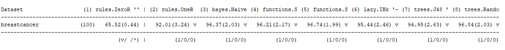
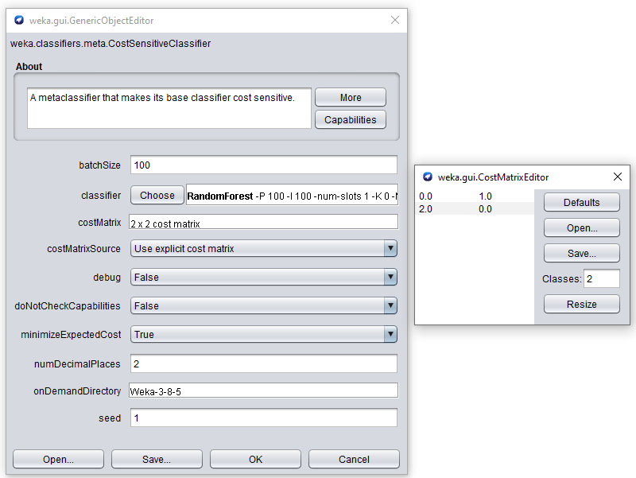
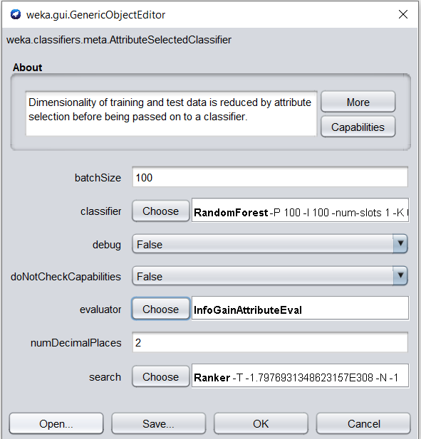

```{r setup, include=FALSE}
knitr::opts_chunk$set(echo = TRUE)
# Add: chunk caching
knitr::opts_chunk$set(cache = TRUE)
```

# Introduction

Despite a great deal of public awareness and scientific research, breast cancer continues to be the most common cancer and the second largest cause of cancer deaths among women. Approximately 12% of U.S. women will be diagnosed with breast cancer, and 3.5% will die of it. The research in clinical practice depends on the analysis of cellular images which is accomplished with a graphical computer program called **Xcyt**, written by one of the authors.\cite{research}

First, a sample of fluid is taken from the patient's breast. The procedure involves using a small-gauge needle to take fluid, known as fine needle aspirate (FNA), directly from a breast lump or mass. An image from the FNA is used for the program Xcyt.\cite{research} This digitized image is used to asses whether a lump in a breast could be malignant (cancerous) or benign (non-cancerous).\cite{neuraldesigner}

The research question is: Is it possible to reliably predict the cancer stage based on the uniformity of cell size/shape using machine learning?

## Data description 

The data obtain information about breast cancer in Wisconsin. This was provided by Dr. William H. Wolberg of the University of Wisconsin Hospitals. 

## Data set information 

The samples are clinical cases of Dr. Wolberg which are periodically classified and are ordered in a chronological grouping. The grouping is as followed:

Group 1: 367 instances (January 1989)  
Group 2: 70 instances (October 1989)  
Group 3: 31 instances (February 1990)  
Group 4: 17 instances (April 1990)  
Group 5: 48 instances (August 1990)  
Group 6: 49 instances (Updated January 1991)  
Group 7: 31 instances (June 1991)  
Group 8: 86 instances (November 1991)  
-----------------------------------------  
Total: 699 points (as of the donated database on 15 July 1992)  

Table \ref{tab:codebook} shows the codebook of the data which provides an overview of the data frame and the variables. 

```{r codebook}
## Load the codebook
codebook <- read.csv(file = "codebook.txt", sep = ";")
kable(codebook, caption = "Codebook with an overview of the data.")
```

\newpage

```{r}
## Libraries
library(ggplot2)
library(dplyr)
library(kableExtra)
library(tidyverse)
library(pheatmap)
library(stats)
library(cowplot)
library(ggbiplot)
library(png)
library(ggpubr)
```

# Exploratory Data Analysis (EDA) of breast cancer

Before the data is visualized is the data loaded. After the following code, the data is available to use.

```{r}
## Define the data file
datafile <- "data/breast-cancer-wisconsin.data"

breastcancer <- read.table(datafile, sep = ",", header = FALSE, 
                           na.strings = "?")

## Change the column names 
colnames(breastcancer) <- c("id", "clump_thickness", "uniformity_of_cell_size", 
                            "uniformity_of_cell_shape", "marginal_adhesion", 
                            "single_epithelial_cell_size", "bare_nuclei", 
                            "bland_chromatin", "normal_nucleoli", "mitoses", 
                            "class")

## Create new variables for the column class
breastcancer <- breastcancer %>% 
    mutate(class = factor(class, labels = c("Benign", "Malignant"), 
                          levels = c(2, 4)))

## Inspect the data
str(breastcancer)
```

\
\
\

```{r}
## Show the first 6 rows of the breast cancer data
head(breastcancer)
```

\
\
\

```{r}
## Give an summary of the data
summary(breastcancer)
```

The outcome of the summary shows that every column has the same minimum and maximum except the id and the class but these columns aren't properties. The 1st Qu, median, mean and 3rd Qu are different for every column but they all lie close to each other. At the minimum and maximum, you can see that the data only consist of the numbers 1 to 10.

## Missing data

To check if there is missing data, a table is generated with the number of NA's per column with the following code.

```{r table_na}
kable(colSums(is.na(breastcancer)), col.names = "Number of NA's", 
      caption = "The number of NA's per column")
```

Table \ref{tab:table_na} shows the number of NA's in the dataset of breast cancer. It shows that there are 16 NA's in de column bare nuclei, the other columns have 0 NA's. For the research question, there will be looked at the uniformity of cell size/shape and not at the column bare nuclei. Since there are only 16 NA's and in the column that isn't relevant so it doesn't affect the research question. To deal with these missing values column bare nuclei can be dropped. For the visualizations now it doesn't impact the data so these values aren't removed.

\newpage

## Displaying the variation of the breast cancer dataset 

Here is the variation within the data and the distribution of the data examined.

```{r pivot_head}
## Tidying the data by using pivot_longer
breast_long <- pivot_longer(data = breastcancer, 
                            cols = -c("id", "class"),
                            names_to = "property", 
                            values_to = "value")

## Show the first 6 rows of the breast cancer dataset after pivot_longer
kable(head(breast_long), digits = 6, caption = "Head of the 'lengthens' data")
```

In table \ref{tab:pivot_head} the number of rows is increased and the number of columns is decreased compared to the original loaded data. With the new form of the data it can be visualized easily per property. 


One of the visualization to examine the variation and the distribution is a histogram.

```{r, fig.cap="\\label{fig:hist}Histogram with the total count of the properties per stage of breast cancer.", out.width="75%"}
## Plot the histogram with geim_histogram 
ggplot(data = breast_long, mapping = aes(x = property, y = value)) +
  geom_histogram(stat = 'identity', aes(color = class, fill = class)) + 
  scale_fill_manual(values = c("steelblue", "plum1"), 
                    aesthetics = c("color", "fill")) + 
  labs(x="Property (n/a)", y="Total count of values (n/a)", 
       color = "Class", fill = "Class") + 
  coord_flip() +
  scale_x_discrete(labels = sort(codebook$Full.Name[2:10])) +
  theme_classic()
```

Figure \ref{fig:hist} shows the total count of the properties per stage in a histogram. The plot shows the properties for the class benign and malignant. The variance between the total of the properties per class lie close to each other except for the properties mitoses, here is the total the lowest, and clump thickness, here is the total the highest. Figure \ref{fig:hist} shows that the distribution of the classes differ from each other because the class benign has a smaller bar than the class malignant and so a lower count for benign. The data consist of the number 1 to 10 and this says something about how benign or malignant a property is for the id of the person. So with this figure \ref{fig:hist} you can't say which class belongs to the person only what the total count of a property is for a class. The class benign has mainly values of 1 so this explains why the bar of the class benign per property is smaller. And the class malignant has mainly values of 10 so this bar is longer but the class can also have values of 1. These values can't say which attribute is more informative in the model process because of the difference in values of the properties. But it can say that the class malignant has higher values than the class benign because the total count and the bar is bigger.

\newpage

## Underlying relationship 

```{r, fig.cap="\\label{fig:relationship}Relationship between the properties and their values for both the classes of breast cancer.", out.width="70%"}
## Displays the plot with geom_jitter
ggplot(data = breast_long, mapping = aes(x = property, y = value, color = class)) +
  geom_jitter(alpha = 0.8, stat = "identity") +
  scale_colour_manual(name = "class", values = c("steelblue", "plum1"), 
                      aesthetics = c("color", "fill")) +
  labs(x = "Property (n/a)", y = "Value (n/a)") +
  theme_minimal() +
  theme(axis.text.x = element_text(angle = 90, vjust = 0.5, hjust=1)) +
  scale_x_discrete(labels = sort(codebook$Full.Name[2:10])) +
  scale_y_continuous(breaks = c(1:10))
```

Figure \ref{fig:relationship} shows the relationship between the properties and their values for both classes. All of the properties have a variation for all values except mitoses here the values are very low. Here is it easy to see that benign consist of mainly 1 values because at value 1 there are a lot of dots in one group for every property except single epithelial cell size there lies the group at value 2. Most of the values for benign lies from 1 until 5. For malignant are the dots scattered over the value range. But there are also groups at value 10 for most of the properties. So here can be seen that malignant mainly consist of value 10. The variation and the distribution of both classes for the properties uniformity of cell size and uniformity of cell shape look alike so these can both be useful to predict the cancer stage.

\newpage

## Displaying the distribution of breast cancer data

```{r, fig.cap="\\label{fig:line}Correlation of the values per property divided into the two stages of breast cancer using a line plot."}
## Plot the plot with geom_line
ggplot(breast_long, aes(x = value, y = property)) + 
  geom_line(aes(color = class, linetype = class)) + 
  scale_color_manual(values = c("darkred", "steelblue")) +
  theme_minimal() +
  labs(x = "Value (n/a)", y = "Property (n/a)", 
       colour = "Class", linetype = "Class") +
  scale_y_discrete(labels = sort(codebook$Full.Name[2:10])) +
  scale_x_continuous(breaks = c(1:10))
```

Figure \ref{fig:line} displays the relationship between the properties and there values for both stages of breast cancer. The blue dotted line shows the stage benign and the red continuous line shows the stage malignant. In the figure \ref{fig:line} can be seen that the every property has an line for malignant until 10 so malignant contains every value from 1 through 10. For benign are there three properties with an value of 1 through 10 which are Single Epithelial Cell Size, Marginal Adhesion, and Bare Nuclei. The other properties has for benign every value through between 7 and 9 where Bland Chromatin consist of values until 7. From the figure can be seen that benign consist mostly of the low values and that malignant consist of every value but mostly high values. Just like in figure \ref{fig:relationship} can be seen that benign has there values very low as seen at the blue color. Malignant on the other hand has more variation and higher values as seen in figure \ref{fig:relationship}.

 
To check the class distribution, so if the classes are evenly or unevenly represented a bar plot is used. 

```{r, fig.cap="\\label{fig:bar}Bar plot of the total number of values per class.", out.width="75%"}
## Plot the bar plot using ggplot
ggplot(data = breast_long, mapping = aes(class, value)) + 
  geom_bar(stat = "identity", aes(color = class, fill = class)) +
  scale_fill_manual(values=c("steelblue", "plum1"), 
                    aesthetics = c("color", "fill")) +
  labs(x="Class (n/a)", y="Total count (n/a)", color = "Class", fill = "Class") +
  theme_minimal()
```

The bar plot in figure \ref{fig:bar} shows the total number of values per class. Here you can see that the classes are unevenly represented, the total is higher for the class malignant. But this can be, as described in figure \ref{fig:hist}, that the class benign mainly consist of low values such as 1 and that the class malignant mainly consists of high values such as 10. The figure shows the total of these values. So this could explain why the bar for the class malignant is higher. This doesn't say that there is more malignant than benign.

\newpage

```{r, total_class}
kable(table(breastcancer$class), col.names = c("Class", "Total"), 
      caption = "Total number of the class")
```

Table \ref{tab:total_class} shows the total number of benign and malignant. Figure \ref{fig:bar} shows that the total of malignant is higher than benign but in table \ref{tab:total_class} you can see that the total of the class benign is more. This is because table \ref{tab:total_class} shows the total number of rows with the class and figure \ref{fig:bar} shows the total count of the values 1 to 10 for each class. So in table \ref{tab:total_class} you can see that there isn't more malignant than benign. So here are the classes also unevenly represented but then the other way around. 

\newpage 

## Correlation of breast cancer

```{r, fig.cap="\\label{fig:bubble}Bubble plot with the total number of values per property divided into the stage of cancer. A predicted linear regression is added for each stage of cancer.", out.width="75%"}
## Plot the scatter plot
ggplot(data = breast_long, mapping = aes(x = property, y = value)) +
  geom_count(aes(color = class), alpha = 0.6) +
  geom_smooth(aes(group = class, color = class), method = "lm", se = FALSE) +
  scale_fill_manual(values = c("steelblue", "darkred"), 
                    aesthetics = c("color", "fill")) +
  labs(x="Property (n/a)", y="Value (n/a)", color = "Class", fill = "Class") +
  theme_minimal() +
  theme(axis.text = element_text(angle = 90)) +
  #facet_wrap(. ~ class) +
  scale_x_discrete(labels = sort(codebook$Full.Name[2:10])) +
  scale_y_continuous(breaks = c(1:10))
```

The bubble plot in figure \ref{fig:bubble} shows the total count of the values, the bubbles, per property for each class. The plot contains a linear regression of the blue and red line per stage of cancer. The legend of the bubble plot contains n which is has bubbles for each total count of the values. Benign in figure \ref{fig:bubble} is colored blue and can be seen mostly between values 1 through 4, for value 1 and 2 has benign big bubbles with an n of 400. Having a closer look are there small bubbles by values 4 and 5 but the bubbles consist mainly of malignant. The linear regression line of benign decreases from 2 through 1 so it has a negative relationship. For the class malignant are there bubble everywhere except at value 9 by mitoses. Mitoses has as only property for malignant the biggest bubble of n is 300 and consist mostly of low values. Malignant has mainly high values as seen in \ref{fig:bubble} which are transparent, the non transparent for malignant has also a count for benign. The linear regression of malignant lies higher than the one for benign, its starts around 6.5 through 5.5 and has also an negative relationship because it decreases.   


```{r, fig.cap="\\label{fig:heatmap}Heatmap with the correlation matrix of the properties.", out.width="75%"}
## Get the correlation matrix
cormat <- signif(cor(na.omit(breastcancer[2:10])))

## Plot the heatmap
pheatmap(cormat, labels_row = codebook$Full.Name[-1], 
         labels_col = codebook$Full.Name[-1])
```

Figure \ref{fig:heatmap} shows the correlation of the properties. Red shows that the properties are highly correlated and blue shows a low correlation. Here in figure \ref{fig:heatmap} are the properties highly correlated with themselves because they contain the same values. The heatmap shows a patron in the middle because this contains a correlation value between 0.5 and 1 for every property. Only the outside of the heatmap shows a lower correlation for the property mitoses compared with the other properties. Here is the correlation value between 0 and 0.5 and is colored blue. There are two properties with a higher correlation for each other are Uniformity of cell size and Uniformity of cell shape. The blocks of these properties are slightly lighter than the dark ones. So this shows that these properties have a high correlation with each other. This can also be seen at the branches of the dendrogram because here are the two properties in one cluster.

\newpage

## Clustering of the dataset 

The next figures are clusters based on two properties the uniformity of cell size and shape. 

```{r, fig.cap="\\label{fig:cluster}kMeans cluster of uniformity of cell size and shape per class.", out.width="75%"}
kmeans.cluster <- kmeans(is.na(breastcancer), centers = 2)

clusters <- as.factor(kmeans.cluster$cluster)

clust1 <- ggplot(breastcancer, aes(uniformity_of_cell_size, class, 
                                   color = clusters)) +
  geom_point(size = 0.5, position = position_jitter(height = 0.3, width = 0.3)) +
  labs(x="Uniformity of cell size", y="Class") +
  theme_minimal() +
  scale_x_continuous(breaks = c(1:10))

clust2 <- ggplot(breastcancer, aes(uniformity_of_cell_shape, class, 
                                  color = clusters)) +
  geom_point(size = 0.5, position = position_jitter(height = 0.3, width = 0.3)) +
  labs(x="Uniformity of cell shape", y="Class") +
  theme_minimal() +
  scale_x_continuous(breaks = c(1:10))

combined <- plot_grid(clust1 + theme(legend.position = "none"), 
                      clust2 + theme(legend.position = "none"),
                      labels = c('A', 'B'), label_size = 12)

combined_legend <- get_legend(clust2 + guides(color = guide_legend(nrow = 1)) +
    theme(legend.position = "bottom"))

plot_grid(combined, combined_legend, ncol = 1, rel_heights = c(1, .1))
```

Figure \ref{fig:cluster}A shows a kMeans cluster of the property uniformity of cell size for both classes. It shows that there is a cluster for the class benign at value 1, and there is small cluster at values 2 and 3. The other blue dots are scattered between values 4 and 9. For the class malignant is there a cluster at value 10 and smaller clusters at value 3 until 8. For this class are the blue dots are more scattered over the values. The cluster for both classes can be explained that benign has more 1 values and malignant has more 10 values. By both classes are the pink dots scattered in the plot these are small clusters.

Figure \ref{fig:cluster}B looks almost the same as in figure 
\ref{fig:cluster}A but here are the blue dots more scattered between the values 3 until 8 and there are more pink clusters. The class malignant has in one eye the same shape of clusters as in figure \ref{fig:cluster}A and it also has two pink clusters. 


### Principal Components Analysis (PCA) of the dataset

```{r, fig.cap="\\label{fig:pca}PCA plot with the variances of the data breast cancer. A: Scree plot with the variance of each PC. B: PCA plot with scores of the variation of PC1 and PC2.", fig.show='hold', out.width="50%"}
## Remove NA's 
bc <- na.omit(breastcancer[,2:10])

## Call prcomp for principal component analysis
bc_pca <- prcomp(as.matrix(bc), scale. = T, center = T)
screeplot(bc_pca, type = "l", main = "A: Scree plot")

summary(bc_pca)

## Get the rows with the NA's to removed for grouping in ggbiplot
removed <- as.numeric(subset(row.names(breastcancer),
                             is.na(breastcancer$bare_nuclei)))

## Plot the PCA
ggbiplot(bc_pca, obs.scale = 1, var.scale = 1, ellipse = TRUE, 
                     circle = TRUE, group = breastcancer$class[-removed]) +
  scale_color_discrete(name = "") + 
  labs(subtitle = "B") +
  theme_minimal() +
  theme(legend.direction = 'horizontal', legend.position = 'top')
```

The summary of PCA shows the variance related measures of components. Here can be seen at the proportion of variance that first component, PC1, explains 65,5% of the variability in the data set. Second component, PC2, explains 8,62% of the total variability in the data set. This indicates an total variation that is shows at the line cumulative proportion of 74,17%. The percentage of PC1 and PC2 are shown in the labels of the PCA plot \ref{fig:pca}B on the axes.   

Figure \ref{fig:pca} shows a principal component analysis (PCA) where figure \ref{fig:pca}A shows the scree plot of the variances and figure \ref{fig:pca}B shows a biplot for the first two principal components. The scree plot \ref{fig:pca}A shows how much variation each PC captures from the data where the x-axis shows the number of PC's and the y-axis shows the variances, the amount of variation. In the scree plot can be seen that PC1 and PC2 describes the data the best because these point lie higher than the other points. From 2 until 9 have the lines the least variation between the points. Thus from PC1 and PC2 is the PCA plot made as seen in figure \ref{fig:pca}B. The PCA plot \ref{fig:pca}B shows the scores of samples displayed as points and the loadings of variables displayed as vectors. The points are divided into the two classes benign and malignant as seen in the legend. The points of benign all lie at the right side of the PCA and form an cluster shown by the circle, except for a few points. And the points of malignant all lie at the left side of the PCA and from also an cluster shown by the circle, except for a few points. The PCA has an PC origin at [0,0], how further the vectors are from the PC origin, how more influence they have on that PC. In the plot can be seen that mitoses has a longer vector and points in an different direction compared to the other properties. Because mitoses has an longer vector has it an negative correlation and it lies further from the PC origin. Mitoses also outside of the cluster from benign while the other properties lie in the cluster of benign.   

\pagebreak

# Cleaning the dataset 

```{r table_sums}
## Get the total number of value per column
kable(colSums(na.omit(breastcancer[2:10])), 
      col.names = "Total number of values", 
      caption = "The total number of values per column")

## Remove the column of mitoses
breast_clean <- breastcancer[-10]

## Tidying the data by using pivot_longer
clean_long <- pivot_longer(data = breast_clean, 
                           cols = -c("id", "class"),
                           names_to = "property", 
                           values_to = "value")
```

Table \ref{tab:table_sums} shows the total number of values per property. In the table can be seen that there most of the total lies between 1900 and 3000 but there is only one exception that is for mitoses here are there only 1095. In all the figures above especially in figure \ref{fig:heatmap} and \ref{fig:pca}B can be seen that mitoses is different that the other properties. Because in the heatmap \ref{fig:heatmap} shows mitoses for both classes a very low correlation value of 0. In the PCA plot \ref{fig:pca}B points the vector of mitoses the other way compared to the other properties which points in the same direction and lie in the same cluster. Therefore the column mitoses is removed form the dataset. 


```{r, fig.cap="\\label{fig:heatmap_clean}Heatmap with the correlation matrix of the properties. After the removal of the property mitoses.", out.width="75%"}
## Get the correlation matrix
cormat <- signif(cor(na.omit(breast_clean[2:9])))

## Plot the heatmap
pheatmap(cormat, labels_row = codebook$Full.Name[-1], 
         labels_col = codebook$Full.Name[-1])
```

Figure \ref{fig:heatmap_clean} shows the correlation matrix in a heatmap for all properties. Here can be seen that the property mitoses is removed compared to the heatmap in figure \ref{fig:heatmap}. The legend with the colors is also adapted, here is the lowest value 0.5, and in figure \ref{fig:heatmap} 0.3. In the heatmap \ref{fig:heatmap_clean} are the properties highly correlated with themselves because they contain the same values. The heatmap shows a better patron than in figure \ref{fig:heatmap} because mitoses isn't shown here otherwise, the figure has remained the same. The two properties Uniformity of cell size and Uniformity of cell shape show a high correlation with each other and are in the same cluster.

\newpage 

```{r}
## Create a csv file for Weka 
write.csv(breast_clean, "/homes/crhazenberg/Thema9/MachineLearning/breastcancer.csv", 
          row.names = FALSE, na = "")
```

# Determine quality metrics 

After an machine learning performance shows the performance an accuracy which is the default metric. But there are also other metrics that can be applied and are may be more accurate and relevant.   

For the dataset there are two classes benign and malignant but it is important that these classes are correctly predicted and performed. Because when the test shows benign then you don't want to be malignant after all and when you are malignant you want to be sure that you are and not that it is actually benign so that the test is incorrectly.    

So by decreasing the number of false positives (FP). Thus it is important that the predicted class benign is actually malignant is reduced. It not important that the false negatives are reduced because the prediction is malignant and the actual class is benign and this is good because you want to be benign before and after an test and not malignant. As seen in table \ref{tab:matrix} where the first row is the predicted class and the second and third row is the real class of breast cancer. Here stand FP by the predicted class benign but the actual class is malignant.
It is important that the classification is accuracy but it should be fast because if the test shows malignant then they need to treat it as soon as possible before it gets worse. So in a more accurate metric should FP be decreased.    


The confusion matrix consist of the following layout in Weka:

=== Confusion Matrix ===  

   a   b   <-- classified as          
  TP  FN |   a = Benign  
  FP  TN |   b = Malignant

  
```{r}
matrix <- read.csv("wekadata/matrix.csv", sep = ";", header = TRUE) 
rownames(matrix) <- colnames(matrix) <- NULL
kable(matrix)
```


\pagebreak
# Performance of Machine Learning algorithms 

With the clean dataset we start investigating the performance of all standard ML
algorithms with the standard setting in Weka. 

```{r classifiers}
classifiers <- read.csv("wekadata/classifiers.csv", header = TRUE, sep = ";")
kable(classifiers, caption = "Classifications using 10-fold cross validation")
```

Table \ref{tab:classifiers} shows the results of the machine learning algorithms with 8 classifier categories. The results shows the speed, accuracy, True Positive (TP), False Positive(FP), True Negative(TN), and False Negative(FN), the last four are part of the confusion matrix in Weka. The accuracy is shown in percentages. The first rows shows the outcome of the classifier ZeroR, here can be seen that the accuracy is 65,5222% and that there are only TP 458 and FP 241, FN and TN have both a value of 0. OneR has an accuracy of 92,7039% which is already higher than for ZeroR. OneR has 444 TP, 37 FP, 14 FN and 204 TN which has thus more FN and TN than ZeroR. The next classifier in the table is NaiveBayes, this classifier has a higher accuracy than both ZeroR and OneR which is 96,4235% NaiveBayes contains 439 TP, 6 FP, 19 FN and 235 TN. Another classifier that is used is SimpleLogistic which has an accuracy of 95,7082% it also has 446 TP, 18 FP, 12 FN and 223 TN. The fifth row of table \ref{tab:classifiers} contains the results of the classifier SMO. SMO has an accuracy of 96.5665% which has so far the highest accuracy. It has 444 TP, 10 FP, 14 FN and 231 TN. The next classifier is IBk with an accuracy of 95,1359% and it has 443 TP, 19 FP, 15 FN and 222 TN. The seventh classifier is J48 with an accuracy of 94,9928%. J48 has 438 TP, 15 FP, 20 FN and 226 TN. The last classifier is RandomForest which has an accuracy of 97,1388% and has thus the highest accuracy of all the classifiers. RandomForest has 443 TP, 5 FP, 15 FN and 236 TN. In general has all the classifiers a low speed which is the time it takes to build the model in seconds, SimpleLogistic takes the longest to build the model. Comparing the accuracy for all the classifiers you can be seen that ZeroR has the lowest accuracy this is because ZeroR has for both FN and TN 0. ZeroR shows the most likely class with only the value of both class benign and malignant which are total number of the classes just like in \ref{tab:total_class}. RandomForest has the highest accuracy and the other classifiers lie in between with little difference between them. Every classifier has in the 400 True Positives and in the 200 True Negatives except ZeroR. The False Positives and the False Negatives is different for every classifier but no major difference between them. Only OneR has a bigger difference in the number of False Positives compared to the other classifiers. The two algorithms with the highest accuracy are RandomForest and SMO. These algorithms are probably the most effective because of their high accuracy. 


```{r, fig.cap="\\label{fig:experimenter}Accuracy of the algorithms for breast cancer. v is here significant higher than the test base ZeroR and * is significant lower than ZeroR.", out.width="95%"}

```

Image \ref{fig:experimenter} shows the output of the experiment of the same algorithms in table \ref{tab:classifiers} but with 10 repetitions. ZeroR is the test base so the other algorithms are compared to ZeroR which has an accuracy of 65,52% also in table \ref{tab:classifiers}. For OneR is the accuracy 92,01% with a standard deviation of 3,24 and in table \ref{tab:classifiers} is this 92,7039% for 1 repeat. This is in line with each other because of the standard deviation can it has a difference of 3,24. OneR has a significant higher accuracy than ZeroR which can be seen at the v after the standard deviation. NaiveBayes has an accuracy of 96,37% for 10 repeats with an standard deviation of 2,03 and it is also significant higher than ZeroR. In table \ref{tab:classifiers} has NaiveBayes an accuracy of 96,4235% for one repeat which is in line with each other. SimpleLogistic has an accuracy of 96,21% in image \ref{fig:experimenter} with an standard deviation of 2,17 and it is also significant higher than ZeroR. In table \ref{tab:classifiers} has SimpleLogistic an accuracy of 95,7082% which is lower than in image \ref{fig:experimenter} but is has an standard deviation of 2,17 so this has no effect because it has an other number of repetitions. SMO has an accuracy of 96,74% with an standard deviation of 1,99 and is also significant higher than ZeroR. In table \ref{tab:classifiers} has SMO an accuracy of 96,5665% which has a low difference with each other. IBk has accuracy of 95,44% and an standard deviation of 2,46. IBk has an accuracy of 95,1359% in table \ref{tab:classifiers} and has a little difference. Number 7, J48 has an accuracy of 94,95% with an standard deviation of 2,63. J48 has a very low difference with 1 repeat as seen in table \ref{tab:classifiers}. The last one RandomForest has an accuracy of 96,84% but it has an higher accuracy for one repeat as seen in table \ref{tab:classifiers} which is 97,1388% but it has an standard deviation 2,03 so it can differ. For the two best algorithms it doesn't matter because SMO and RandomForest have still the highest accuracy after 10 repeats. 

```{r, fig.cap="\\label{fig:costsensitiveimage}The settings of the CostSensitiveClassifier and the CostMatrix.", out.width="75%"}

```

The image \ref{fig:costsensitiveimage} shows the settings of the CostSensitiveClassifier. The minimizeExpectedCost is set to True, this is called cost sensitive classification. Here the cost is limited by adjusting the probability threshold while applying the model. The model doesn't change. In the CostMatrixEditor the 2.0 is adapted so that the FP in the cost matrix is reduced.    

```{r, costsensitive}
cost <- read.csv("wekadata/costsensitiveclassifier.csv", header = TRUE, sep = ";")
kable(cost, caption = "CostSensitiveClassifier for the two algorithms")
```

Table \ref{tab:costsensitive} shows the CostSensitiveClassifier for the most effective algorithms RandomForest and SMO. The costMatrix of the CostSensitiveClassifier is adapted for each build. For RandomForest has each row a different confusion matrix and accuracy while SMO has the same confusion matrix and accuracy for each build. In the costMatrix is the cost of the False Positive in the confusion matrix increased so the False Positive decreases. This is necessary because we don't want people who are actual benign predicted to be malignant. With an normal matrix of equal values the number of FP is 5 for RandomForest. With an increase of the costMatrix for FP the number decreases to 2 and 1. The accuracy also decreases first is the accuracy 97,1388 as seen at the first row of table \ref{tab:costsensitive}. Even the number of TP decreases but the number of FN and TN increases. FN increases because there are people are tested malignant but they are actually benign and this is better so we want more FN. The classifier SMO has for every costMatrix the same accuracy and the same values. For RandomForest is the costMatrix of 2 the best because this has an high accuracy and the TP are still high compared to the costMatrix of 3 and 4. This is important because the people who are benign are actually benign and we want people to be benign not malignant. 


\newpage
# Attribute Selection

Here is the effect of the Attribute Selection methods investigated. 

## Single attribute evaluation

For single attribute evaluation, which deletes attribute that don't say much about the classes, are there four evuluators applied.

```{r, fig.cap="\\label{fig:settings}The settings of the AttributeSelectedClassifier.", out.width="50%"}

```

In image \ref{fig:settings} is the classifier changed to RandomForest and SMO the two best algorithms. The evaluator is also adapted to *CorrelationAttributeEval*, *OneRAttributeEval*, *InfoGainAttributeEval*, and *GainRatioAttributeEval*. The method search isn't changed this is only set to Ranker.     

```{r, fig.cap="\\label{fig:attributeselection}The outcome of the evaluators from the AttributeSelectedClassifierf for RandomForest and SMO. Subfigure A shows the outcome of the CorrelationAttributeEval. Subfigure B shows the outcome OneRAttributeEval. Subfigure C shows the outcome of InfoGainAttributeEval. Subfigure D shows the outcome GainRatioAttributeEval."}
correlation <- readPNG("images/correlation.png")
oner <- readPNG("images/oner.png")
infogain <- readPNG("images/infogain.png")
gainratio <- readPNG("images/gainratio.png")

im_A <- ggplot() + 
    annotation_custom(rasterGrob(correlation))

im_B <- ggplot() + 
    annotation_custom(rasterGrob(oner))

im_C <- ggplot() + 
    annotation_custom(rasterGrob(infogain))

im_D <- ggplot() +
    annotation_custom(rasterGrob(gainratio))

plot_grid(im_A, im_B, im_C, im_D, labels = c("A", "B", "C", "D"))
```

Image \ref{fig:attributeselection} shows for every evaluator the ranked attributes and the selected attributes for both RandomForest and SMO because the outcome is the same for both algorithms. Subfigure \ref{fig:attributeselection}A shows the output of the correlation ranking filter with the ranked and the selected attributes. The ranked attributes shows the correlation with the attribute ranked from high to low, so uniformity_of_cell_shape has the highest correlation and uniformity_of_cell_size has the second highest correlation. The order of the ranked attributes are also shown by the selected attributes which gives an overview of the attributes order. Subfigure \ref{fig:attributeselection}B shows the ranked and selected attributes from the OneR feature evaluator. The ranked attributes shows the accuracy of OneR and their attribute. Here is uniformity_of_cell_size ranked the highest and uniformity_of_cell_shape is now ranked second. The overview of the selected attribute is different compare to the correlation ranking. In subfigure \ref{fig:attributeselection}C contains the information gain ranking filter with the information gain by ranked attributes with the attribute. Here is uniformity_of_cell_size the highest and uniformity_of_cell_size second just like for OneR but the order of the attribute is a little different. For gain ration feature evaluator in subfigure \ref{fig:attributeselection}D can be seen that normal_nucleoli is ranked the highest with an information gain of 0.399 and is single_epithelial_cell_size ranked second best. So here is the order shown in selected attributes thus different than the other subfigures. ID has for evaluator of the AttributeSelectedClassifier the lowest ranking and has for information gain and gain ration even 0. This is because ID isn't an attribute to determine the stage of cancer.   


```{r attribute_selection}
single_attribute <- read.csv("wekadata/singleattribute.csv", header = TRUE, sep = ";")
kable(single_attribute, caption = "Outcome of the AttributeSelectedClassifier using 10-fold cross validation")
```

Table \ref{tab:attribute_selection} shows the options and the outcome of the AttributeSelectedClassifier. The outcome for every classifier and the options evaluator and search are the same per classifier. The only difference can be seen in image \ref{fig:attributeselection} but here are the outcome of the evaluator per classifier also the same. So \ref{fig:attributeselection}A shows for both RandomForest and SMO the outcome of CorrelationAttributeEval. \ref{fig:attributeselection}B shows for both the classifiers the outcome of OneRAttributeEval. In the image shows \ref{fig:attributeselection}C the outcome of InfoGainAttributeEval for RandomForest and SMO. And the last one \ref{fig:attributeselection}D shows the outcome of the GainRatioAttributeEval for RandomForest and SMO. In table \ref{tab:attribute_selection} have accuracy, TP, FP, FN, and TN the same values as in table \ref{tab:classifiers}. So these evaluators of the AttributeSelectedClassifier doesn't have impact on the accuracy. Just like in figure \ref{fig:attributeselection} where there isn't a difference between RandomForest and SMO is here no difference between the evaluators for the same algorithm.

\newpage
## Attribute subset selection

For attribute subset evaluation, which deletes also attributes that don't look a like, is there one evaluator applied *CfsSubsetEval* in AttributeSelectedClassifier with the search *ExhaustiveSearch* and *BestFirst*. 

```{r csfsubset}
cfssubset <- read.csv("wekadata/cfssubseteval.csv", header = TRUE, sep = ";")
kable(cfssubset, caption = "Outcome of the AttributeSelectedClassifier with CfsSubsetEval and different a search")
```

Table \ref{tab:csfsubset} shows the outcome of the AttributeSelectedClassifier with the evaluator CfsSubsetEval with the search ExhaustiveSearch and BestFirst. The first two rows show the two different search for RandomForest and the last two rows shows the search for deSMO. RandomForest has for both ExhaustiveSearch and BestFirst the same accuracy of 96,2084%, TP of 443, FP of 11, FN of 15, and TN of 230. Compared to table \ref{tab:classifiers} has RandomForest now more FP 11 instead of 5 which is worse because there shouldn't be more people who are tested for benign but are actually malignant. For SMO is the everything also the same, with an accuracy of 96,7096%, TP of 445, FP of 10, FN of 13 and TN of 231. SMO has an higher accuracy compared to table \ref{tab:classifiers} which has an accuracy of 96,5665% and it has 1 more TP and 1 less FN. 


## Meta learners 

The Paired T-Tester and the paired T-Tester (corrected) have both the same effect in the experimenter for the algorithms RandomForest and SMO by an number of repetitions of 10. For both statistical tests has RandomForest an accuracy of 96.84% and SMO an accuracy of 96,74% for 10 repeats. For 1 repeat has RandomForest an accuracy of 97,14% just like in table \ref{tab:classifiers} and SMO has an accuracy of 96,57% just like \ref{tab:classifiers}.

The meta learners that are investigated are *Vote*, *Bagging*, *Boosting*, and *Stacking*. 

```{r meta_learners}
meta_learners <- read.csv("wekadata/metalearners.csv", header = TRUE, sep = ";")
kable(meta_learners, caption = "Meta learners with 10-fold cross validation and 10 repetitions") %>% 
kable_styling(latex_options="scale_down")
```

Table \ref{tab:meta_learners} shows the outcome of the meta learners with a 10-fold cross validation and a repetition of 10. The first column shows the algorithm, the second column shows the classifier that is needed for the algorithm, the third column only applies for the algorithm voting, and the fourth column only applies for the algorithm stacking which needs an metaClassifier. The other columns shows the accuracy, TP, FP, FN, and TN just like the tables described above. The classifiers that are used are RandomForest, SMO, and NaiveBayes. NaiveBayes is added, besides the two best classifiers, because NaiveBayes has in \ref{tab:classifiers} a second best accuracy after SMO  and it has 6 FP 1 more than RandomForest which is important because there need to be a low number of people who are tested benign but are actually malignant. For the first two rows the *Vote* algorithm was used with the classifiers RandomForest, SMO and NaiveBayes and with the combinationRule, Average of Probabilities and Majority Voting. Only the accuracy is different for these two but the confusion matrix is the same. The accuracy is different because of the combinationRule. The Average of Probabilities has the highest accuracy of them both but also for all of the algorithms. The algorithm *Bagging* is used with the classifiers RandomForest, SMO, and NaiveBayes. The algorithm with RandomForest has an accuracy of 96,91% and has also 7 FP and one more FN than Vote. SMO has an accuracy of 96,74% and has more FP than Bagging with RandomForest. NaiveBayes has the lowest accuracy and has less TP and FP but more TN so here are there more malignant. 

# ROC curve analysis 

In the next section visualizes (Receiver Operating Characteristics (ROC) curves for both RandomForest and SMO. ROC curve is a graph showing the performance of a classification model at all threshold settings. The ROC curve is created by plotting the True Positive Rate (TPR) against the False Positive Rate (FPR) where TPR is on the y-axis and FDR is on the x-axis.

```{r, fig.cap="\\label{fig:roc}ROC curve.", out.width="80%"}
roc_data_smo <- read.table("wekadata/roccurve.arff", sep = ",", comment.char = "@")

names(roc_data_smo) <- c("Instance_number", "True_Positives", "False_Negatives",
                         "False_Positives", "True_Negatives", "False_Positive_Rate",
                          "True_Positive_Rate", "Precision", "Recall", "Fallout",
                          "FMeasure", "Sample_Size", "Lift", "Threshold")

colors <- c(classifier ="orange", threshold = "blue")

roc_smo <- ggplot(data = roc_data_smo, mapping = aes(x = False_Positive_Rate, 
                                             y = True_Positive_Rate)) +
  geom_point(mapping = aes(color = "classifier")) +
  geom_line(aes(color = "classifier")) +
  geom_abline(aes(color = "threshold", slope = 1, intercept = 0)) +
  scale_color_manual(values = colors) +
  xlab("False Positive Rate") +
  ylab("True Positive Rate") +
  theme_pubr() +
  theme(legend.title = element_blank())


roc_data_rf <- read.table("wekadata/roccurverrandomforest.arff", sep = ",",
                          comment.char = "@")

names(roc_data_rf) <- names(roc_data_smo)

roc_rf <- ggplot(data = roc_data_rf, mapping = aes(x = False_Positive_Rate, 
                                             y = True_Positive_Rate)) +
  geom_jitter(mapping = aes(color = "classifier")) +
  geom_line(aes(color = "classifier")) +
  geom_abline(aes(color = "threshold", slope = 1, intercept = 0)) +
  scale_color_manual(values = colors) +
  xlab("False Positive Rate") +
  ylab("True Positive Rate") +
  theme_pubr() +
  theme(legend.title = element_blank())


combined_roc <- plot_grid(roc_smo + theme(legend.position = "none"), 
                          roc_rf + theme(legend.position = "none"),
                          labels = c('A', 'B'), label_size = 12)

legend <- get_legend(roc_rf + guides(color = guide_legend(nrow = 1)) +
                       theme(legend.position = "bottom"))

plot_grid(combined_roc, legend, ncol = 1)
```

In figure \ref{fig:roc} there are two figures with an ROC curve. The first one figure \ref{fig:roc}A shows the ROC curve from the algorithm SMO and the second figure \ref{fig:roc}B shows the ROC curve from the algorithm RandomForest. The TPR is plotted against the FPR at various thresholds. The area under the roc curve which is shown in orange is called the Area Under The Curve (AUC) curve. The blue threshold line shown in the figures is a straight line which is the predicted probability of an observation. Figure \ref{fig:roc}A has three dots and is connect with an line. The line is almost 90 degrees and straight with an angle this shows an ideal situation because the two curves of TP and TN almost don't overlap. When the positive and negative class overlap then there are error and runs the model in a curve or in a straight line just like the threshold line.   


\newpage
\begin{thebibliography}{9}

\bibitem{research}
Olvi L Mangasarian, W Nick Street, William H Wolberg: \textit{Research article},  
Breast Cancer Diagnosis and Prognosis via Linear Programming, December 19 1994, Retrieved from https://www.neuraldesigner.com/learning/examples/breast-cancer-diagnosis on 05-10-2021

\bibitem{neuraldesigner}
Neural Designer: \textit{Machine Learning Examples},  
Diagnose breast cancer from fine-needle aspirate images using Neural Designer, Retrieved from the website researchgate.net on 05-10-2021

\bibitem{dataset}
UCI Machine Learning Repository: \textit{Breast Cancer Wisconsin (Original) Data Set}, Center for Machine Learning and Intelligent Systems

\end{thebibliography}
